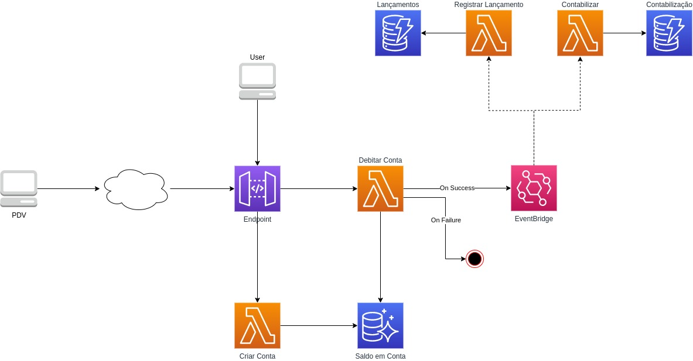

# Autorizador de débito de cartão

Arquitetura de referência para autorizador de débito de cartão totalmente serverless na AWS.

## Objetivo

Montar uma arquitetura que atenda os requisitos de um sistema autorizador de débitos de cartão, que opera do lado da instituição financeira.
A intenção não é reproduzir um sistema exatamente fiel ao real, pois é um sistema complexo. A ideia é mostrar de forma macro como poderia funcionar atendendo os requisitos básicos.

## Requisitos

Um autorizador de débito possui alguns requisitos importantes, que são:
* Tempo limite para processamento de 3 segundos
* Atomicidade no débito, a fim de evitar débitos concorrentes do mesmo saldo

Existem outros requisitos funcionais para um projeto como este, mas para esse projeto vamos nos limitar a estes basicamente.

## Arquitetura (futura)

A arquitetura abaixo é a planejada para exercitar de forma macro o funcionamento da aplicação.



Vamos exercitar o débito em conta e o processamento dele após a confirmação do débito.

Obs.: Esse é um desenho inicial e pode sofrer alterações :)

Pontos que ainda serão avaliados:
* Possivelmente o uso de Step Functions não seja necessário ou possa trazer custos desnecessários
* Utilização de Lambda layer para a biblioteca `psycopg2` deve trazer melhoria de performance
* Utilização de RDS Proxy deve trazer melhoria de performance (principalmente pela reutilização de conexões)
* Possibilidade de criação de um cliente ISO8583 para ficar mais fiel ao projeto de autorização de débito

## Status

**EM ANDAMENTO**

No momento o código disponível nesse repositório contém a prova de conceito realizada inicialmente para provar que é possível utilizar um banco de dados relacional na ponta do serviço, para garantir a concorrência e atomicidade do débito.
Para o projeto, está sendo utilizado um banco de dados Aurora Serverless compatível com PostgreSQL.

## Como usar?

O projeto está totalmente funcional e com todas as configurações automatizadas.
Basta realizar o deploy utilizando Serverless Framework e *voilà*.

```shell script
sls deploy
```

Para criar uma conta basta executar a seguinte requisição (usar a URL base gerada no deploy):
```shell script
curl -X POST  https://XYZ.execute-api.us-east-1.amazonaws.com/dev/conta -d '{"agencia": 1000, "numeroConta": 1234, "saldo": 1000, "numeroCartao": 1111222233334444}' -H 'Content-Type: application/json'
```

Para realizar um débito, execute o comando abaixo:
```shell script
curl -X POST https://XYZ.execute-api.us-east-1.amazonaws.com/dev/debito -d '{"numeroCartao": 1111222233334444, "valor": 50}' -H 'Content-Type: application/json'
```

### Output

Quando fizer o deploy dessa aplicação serão criados os seguintes recursos:
* VPC
* Subnet
* SecurityGroup
* Aurora Serverless (PostgreSQL)
* Lambda Function
    * Criar conta corrente
    * Debitador
    
 Ao criar uma conta corrente utilizando o endpoint REST, a função vai automaticamente criar a tabela de conta corrente.